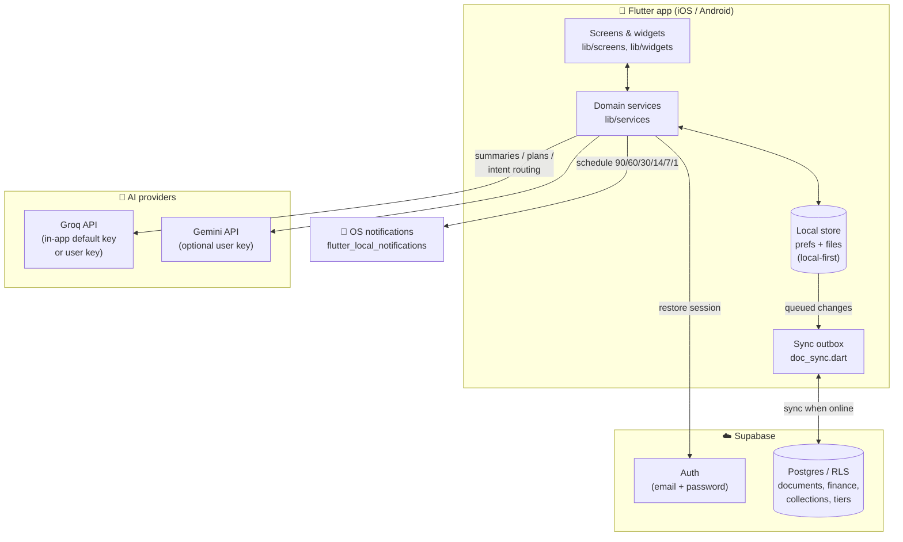
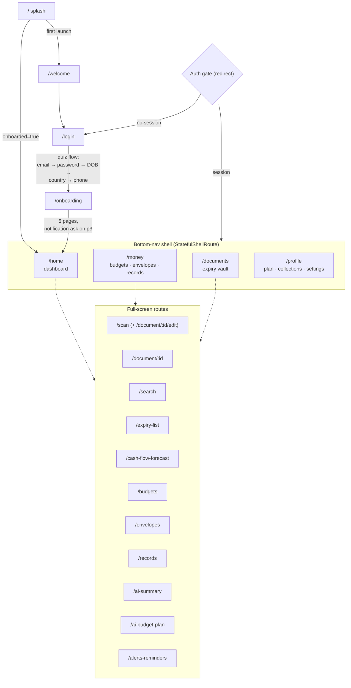
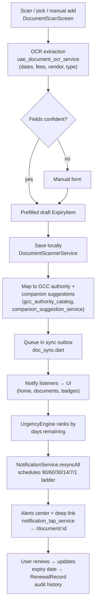
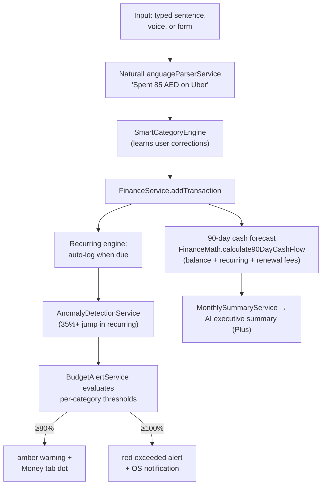
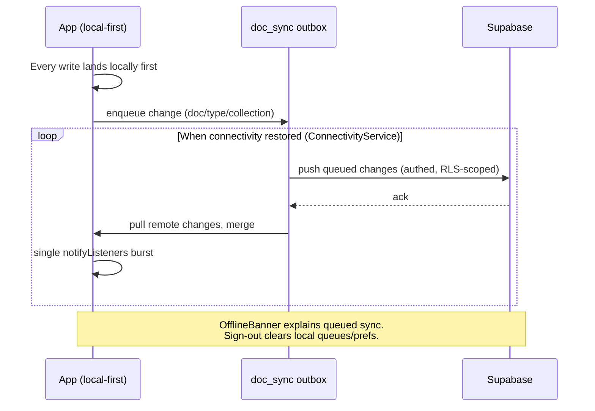
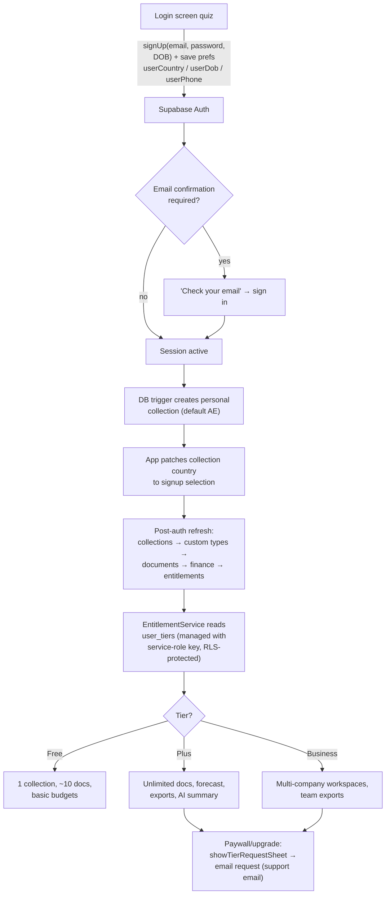
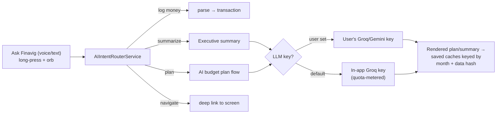
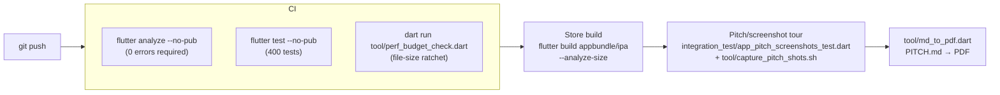

# ARCHITECTURE.md — Finavig workflows & diagrams

How Finavig is built: one Flutter client, local-first storage with a sync
outbox, Supabase for auth/cloud sync/tiers, and LLM providers for the AI
features. Everything below is grounded in the actual code — file names
referenced in each section.

> View on GitHub (Mermaid renders natively) or in VS Code with a Mermaid
> preview extension.

---

## 1. System overview



Key rule: **the app is fully usable offline and signed-out** (local-only
mode). Supabase is optional at runtime — `SupabaseService.hasCredentials`
gates every cloud call, and services fall back to local defaults.

---

## 2. Cold-start workflow (`lib/main.dart`)

```mermaid
flowchart TD
    A[main() starts] --> B["ErrorCaptureService.install()<br/>(capture startup crashes)"]
    B --> C["PerfTracingService frame monitor<br/>+ markFlow(coldStartToHome)"]
    C --> D["ThemeService.init()<br/>(theme before first frame)"]
    D --> E["SupabaseService.initialize()<br/>(no-op when unconfigured)"]
    E --> F["AlertPreferencesService.load()<br/>(before alert engine)"]
    F --> G["BudgetAlertService.init()<br/>(listens for finance changes)"]
    G --> H["StorageMigrationService.migrate()<br/>(one-time legacy folder move)"]
    H --> P["Prewarm services"]
    subgraph P["Prewarm (parallel)"]
        P1["UrgencyEngine.init()"]
        P2["NotificationService.init()<br/>(no permission prompt here)"]
    end
    P --> Q{"Signed in?<br/>AuthService.isSignedIn"}
    Q -- "yes" --> R["CustomDocumentTypeService.init()"]
    R --> S["Collections + Scanner +<br/>Finance + Entitlements init<br/>(parallel)"]
    S --> T["BudgetAlertService.evaluateNow()"]
    T --> U["NotificationService.resyncAll()<br/>(rebuild reminder ladder)"]
    Q -- "no" --> V["skip cloud services"]
    U --> W["runApp(FinavigApp)"]
    V --> W
```

Notes:
- Session restore happens inside `SupabaseService.initialize()`
  (supabase_flutter reads secure storage), so `isSignedIn` is already
  correct here.
- Notification **permission** is never requested at startup — it is
  requested from the onboarding "Allow notifications" page
  (`NotificationService.requestPermission()`).

---

## 3. Navigation map (`lib/router.dart`)



Shell chrome: floating pill nav with a gradient **+** quick-action orb
(scan / log money / voice / envelope; long-press = Ask Finavig AI). Live
badges: Documents dot when any doc ≤30 days, Money dot amber at ≥80%
budget, red at ≥100% (`_AppShell`).

---

## 4. Document lifecycle (scan → alert → renew)



Renewal ladder lead times are user-configurable (Plus gate: custom alert
days).

---

## 5. Money logging & budget workflow



---

## 6. Sync & connectivity



---

## 7. Auth & entitlements



The client **only reads** its tier; grants happen server-side. AI calls
use an in-app default Groq key (pilot) — moving behind a Supabase Edge
Function is a documented pre-scale requirement (see OPTIMIZATION_PLAN).

---

## 8. AI feature workflows



---

## 9. Data model (core entities)

```mermaid
erDiagram
    GCC_COUNTRY ||--o{ DOCUMENT_TYPE : defaults
    DOCUMENT_COLLECTION ||--o{ EXPIRY_ITEM : contains
    EXPIRY_ITEM ||--o{ RENEWAL_RECORD : history
    EXPIRY_ITEM }o--|| CUSTOM_DOCUMENT_TYPE : "optional registry type"
    DOCUMENT_COLLECTION ||--o{ FINANCE_TRANSACTION : scopes
    FINANCE_CATEGORY ||--o{ FINANCE_TRANSACTION : classifies
    FINANCE_CATEGORY ||--o{ BUDGET : limits
    FINANCE_CATEGORY ||--o{ ENVELOPE : saves-for
    RECURRING_TRANSACTION ||--o{ FINANCE_TRANSACTION : generates
    USER ||--|| USER_TIER : entitlement
    USER ||--o{ DOCUMENT_COLLECTION : owns

    GCC_COUNTRY {
        string code AE_SA_KW_QA_BH_OM
        string displayName
        string currency
        string phoneCode
    }
    EXPIRY_ITEM {
        string id
        string displayName
        date expiresAt
        int daysRemaining
        double renewalFee
    }
    FINANCE_TRANSACTION {
        string id
        double amount
        string kind income_expense
        date occurredAt
    }
    USER_TIER {
        string tier free_plus_business
        date planEndsAt
    }
```

---

## 10. Build, test & release pipeline



Docs that pair with this file: `PITCH.md` (product story),
`MONETIZATION.md` (revenue tracks), `OPTIMIZATION_PLAN.md` (perf backlog),
`PRE_DEPLOYMENT_CHECKLIST.md` (launch checklist).
