# Finavig — Documentation

Everything you need to understand, run, and evaluate Finavig.

> **Finavig** is an AI-powered financial budgeting & cash-flow intelligence app with built-in document expiry tracking, built for the UAE: plan budgets, forecast cash, and keep every trade licence, visa, Emirates ID, insurance and subscription countdown — and the money to renew it — on one dashboard. Speak or type one sentence ("Log DEWA bill of 450 AED", "Add Emirates ID expiring 14 Oct 2027") and Finavig routes it, parses it, and asks for one confirmation.

## 📚 Documents

| Document | What's inside |
|---|---|
| **[Technical documentation](technical-documentation.md)** | System architecture, data model & schema, the offline-first sync engine (outbox + LWW merge), the AI layer (Groq routing, voice, OCR), performance instrumentation & CI guards, every feature explained with screenshots, notifications, build & test guide, migrations, known limitations |
| **[Market study](market-study.md)** | The UAE expiry problem in numbers, target segments, competitive landscape (government apps vs calendars vs PRO agents), positioning, demand estimate, monetization options, market risks |
| **[Feasibility study](feasibility-study.md)** | Technical / operational / financial / legal verdicts, remaining risks, effort-to-launch estimate, go-to-market channels, validation metrics, and the go/no-go pilot checklist |
| **[Launch playbook](launch-playbook.md)** | How to start the app (local setup, Supabase SQL order, AI proxy, run & verify), ship it (versioning, signing, store listing, notification QA), and win the **first users** — recruitment funnel, the 20-minute design-partner session, channels, ASO keywords, the 30-day pilot cadence and its KPI tables |
| **[Credit ↔ Money sync](credit-money-sync.md)** | How a borrowed/lent obligation links to the ledger: the four-leg cash lifecycle, the `credit_id` / `credit_leg` tags, settle-time reconciliation of a hand-logged principal, and what reporting excludes |
| **[Credit ↔ Money sync — verification](credit-money-sync-verification.md)** | End-to-end verification report: every sync case, which surface counts a loan leg and which excludes it, and the bugs found and fixed |
| **[App test report](app-test-report.md)** · **[App Lock test report](app-lock-test-report.md)** | Full-suite + complete-flow UI pass, and the App Lock (passcode + biometric) flow report |

Other project-level docs (repo root): [`../ARCHITECTURE.md`](../ARCHITECTURE.md) (workflows & diagrams), [`../PRE_DEPLOYMENT_CHECKLIST.md`](../PRE_DEPLOYMENT_CHECKLIST.md) (pre-launch audit), [`../OPTIMIZATION_PLAN.md`](../OPTIMIZATION_PLAN.md) (performance & quality backlog), [`../FINTECH_ROADMAP.md`](../FINTECH_ROADMAP.md), [`../MONETIZATION.md`](../MONETIZATION.md), [`../PITCH.md`](../PITCH.md), [`../README.md`](../README.md) (quick start).

The AI proxy ships with its own runbook: [`../supabase/functions/groq-proxy/README.md`](../supabase/functions/groq-proxy/README.md).

## 🖼️ Screenshot gallery

Captured from a real app build with seeded demo data. Click any image for full size. All files live in [`screenshots/`](screenshots/).

### First run & accounts

| | |
|---|---|
| **Permission dialog** — notifications explained before the OS prompt | **Splash & version gate** — checks `app_versions` for updates on every launch |
|  |  |
| **Welcome** — dark brand landing: headline, WhatsApp-style quote thread, one *Continue to Login* CTA | **Login** — one-question-per-step quiz (user type → sign-in 3 steps / sign-up 6 steps), always on the dark brand theme |
| 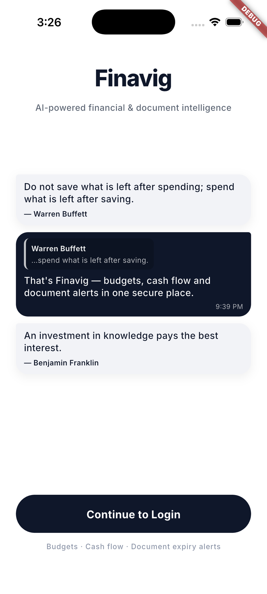 | 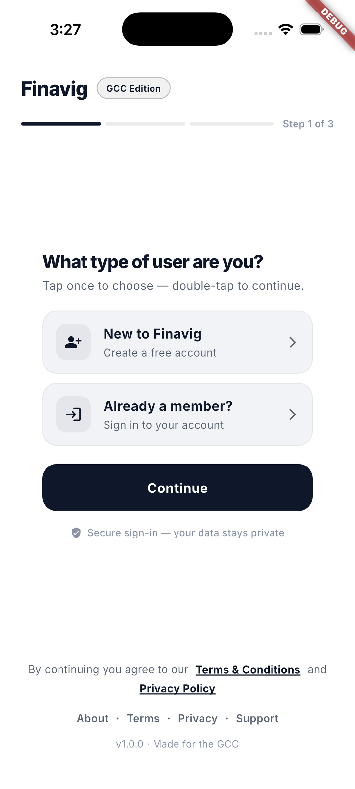 |
| **Sign-up** — picking "New to Finavig" adds date of birth, GCC country and phone | **App Lock** — optional 6-digit passcode with biometric unlock, set up from Profile → Security |
| 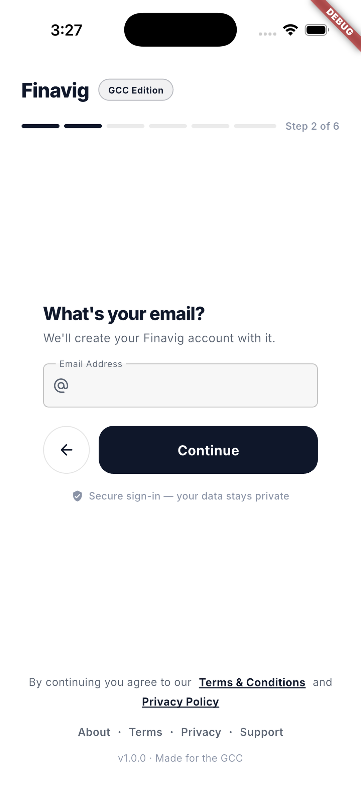 | 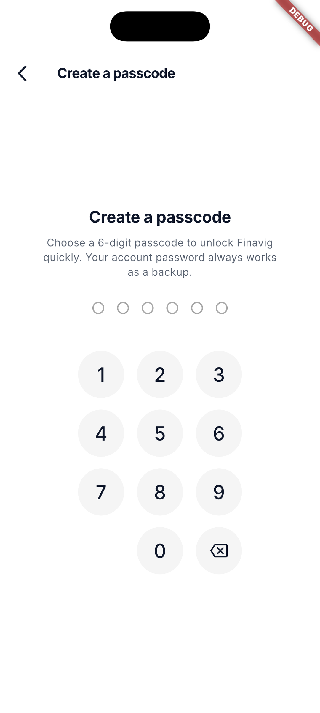 |

> **Capture status:** `02`, `04`–`09`, `13` and `32`–`35` were re-captured from the current build on 2026‑10‑08 with `tool/capture_docs_shots.sh`, so the four tabs now show the redesigned light-canvas layouts. The remaining shots (`00`, `01`, `10`–`31`) still date from the earlier build — re-run that script (and `tool/capture_pitch_shots.sh` for the deck) before reusing this gallery as marketing material.

### Core dashboards

| | |
|---|---|
| **Home dashboard** — one light canvas: bento categories grid, the ink month-balance card with Record/Budget pills, plan-restriction & renewals-need-attention banners, then next renewals | **Money** — light canvas with the month summary as a single **ink card** (net, in/out, Transactions/Budgets/Envelopes pills); the body opens as a **collapsible index** — every section minimised to its header |
| 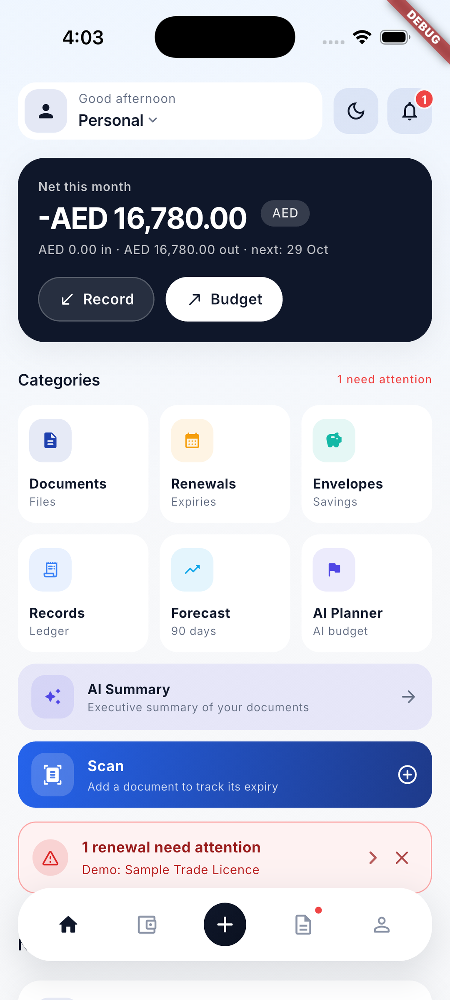 | 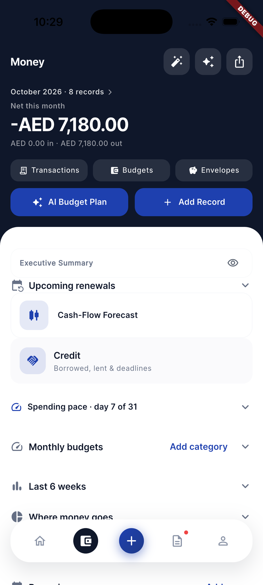 |
| **Money — Credit expanded** — the credit book inside the sheet, with the full Credit page one tap away | |
| 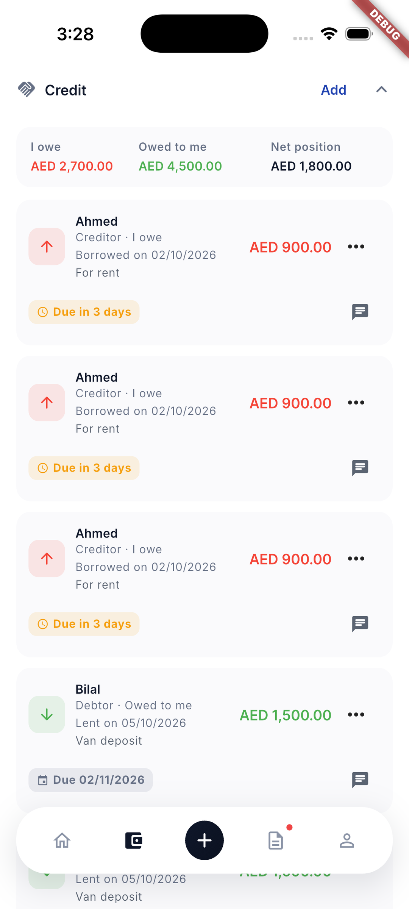 | |
| **Documents radar** — a flat, **card-free ledger** of hairline-divided rows: urgency countdown, status pill, fee, authority and a slim renewal bar, above inline next-due/upcoming-fee stats; search pill, status chips, type-filter & sort sheets | **Profile (Settings)** — a flat, airy list under the dark avatar header: one-tap rows (profile, experience, notifications, collections, subscription, security & app lock, AI summary, help, data) that open bottom sheets |
| 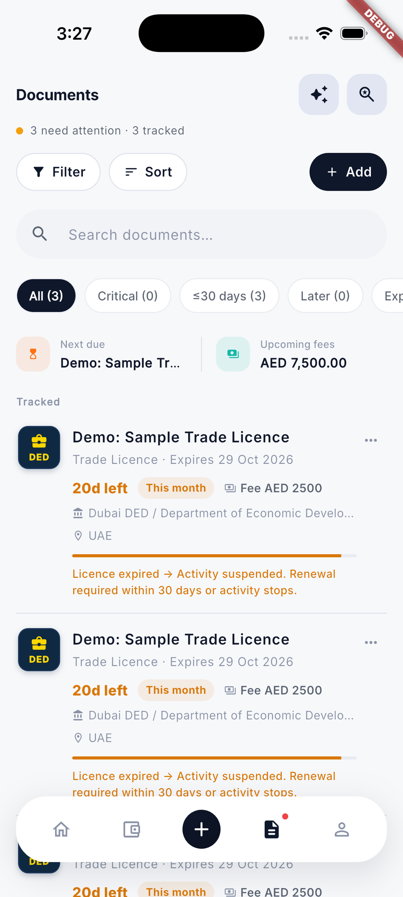 | 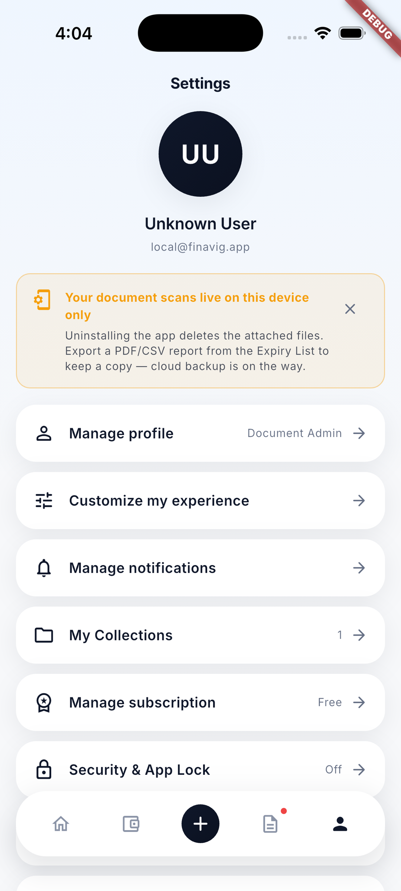 |

### Money features

| | |
|---|---|
| **Budgets** — overall monthly cap + per-category limits with progress meters | **Envelopes** — savings goals, tracked only (no money moves — pre-licence stance) |
|  |  |
| **Renewals / expiry list** — flat chronological view with CSV/PDF export and urgency/type filters | **Records** — month-grouped transactions with smart-category matching; rows written by the credit link wear a **Credit** chip and stay out of the totals |
|  | 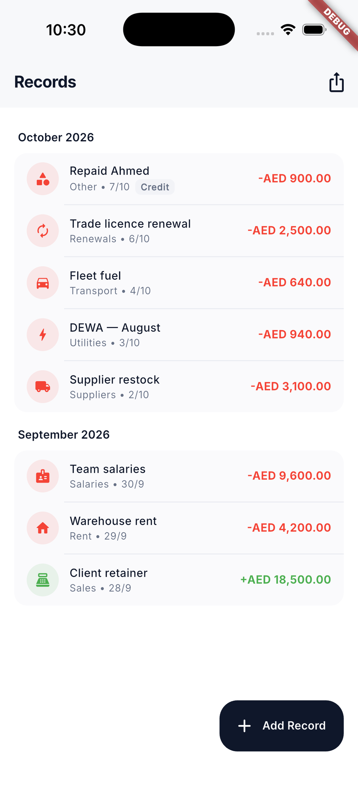 |
| **Credit book** — borrowed/lent obligations: counterparty, amount, borrowed-on and due dates, extensions, settled state and a WhatsApp follow-up | **Credit settle** — close an obligation: log the repayment in Money, attach one you already logged, or only settle the credit |
| 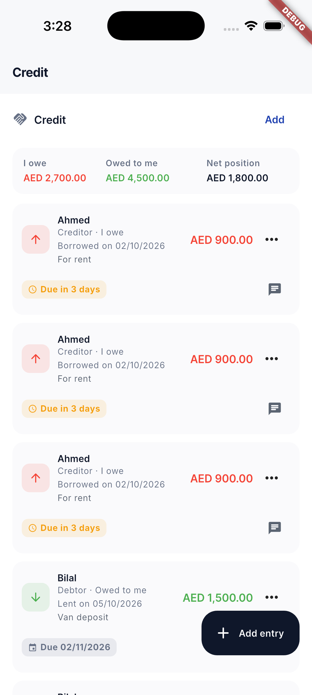 | 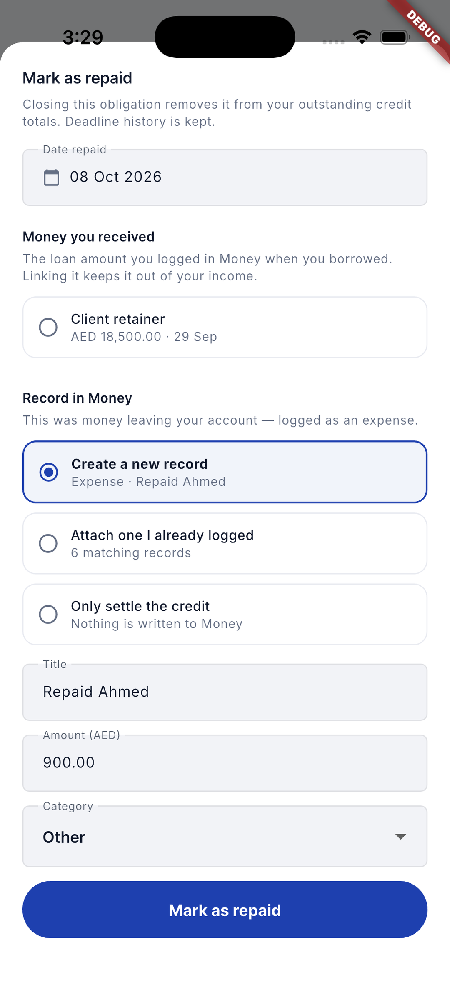 |
| **90-day cash-flow forecast** — daily balance simulation including renewal outflows, filterable event list | **AI Executive Summary** — monthly natural-language financial report (templates offline, optional Gemini polish) |
|  |  |

### AI & capture

| | |
|---|---|
| **Scan & OCR** — ML Kit pre-fills title, type, expiry, emirate & authority from an image | **Companion suggestions** — "businesses tracking this also track…" after adding a document |
|  |  |
| **Home with tracked documents** — banners and renewal tiles populated | **Document detail** — urgency timeline (90·60·30·7), renewal checklist, history, attachments with cached thumbnails |
|  |  |
| **Document detail (bottom)** — attachment card, share, renewal process | **Global search** — across names, notes, authorities, files, all collections |
|  |  |
| **Notifications sheet** — upcoming renewals, expired docs, bill spikes, budget alerts in one place | |
|  | |

### Onboarding flow

| | | |
|---|---|---|
|  |  |  |
|  |  | |

### Quick add — speak or type one sentence

| | |
|---|---|
| **Money record sheet** — quick add from the nav "＋" or hero Record pill | **Transaction form** — full edit with smart category pre-fill |
|  |  |
| **AI category suggestion** — learns your corrections | **Records with data** — month-grouped history |
|  |  |
| **Natural-language add** — "Paid 450 AED for DEWA yesterday" → parsed, categorized, confirmed | |
|  | |

## 🗂️ Database & migrations

| File | Purpose |
|---|---|
| [`../supabase/schema.sql`](../supabase/schema.sql) | Core schema: collections, documents, reminders, custom types + RLS + pg_cron reminder scan (idempotent) |
| [`../supabase/finance_schema.sql`](../supabase/finance_schema.sql) | Finance tables: transactions, budgets, envelopes, recurring + the credit link columns |
| [`../supabase/credit_schema.sql`](../supabase/credit_schema.sql) | Credit tracker: `credit_entries` (borrowed/lent, deadlines, extensions, settled state) + the `credit_id` / `credit_leg` columns + indexes |
| [`../supabase/user_tiers_schema.sql`](../supabase/user_tiers_schema.sql) | Subscription tiers (`user_tiers`) read by `EntitlementService` |
| [`../supabase/ai_quota_schema.sql`](../supabase/ai_quota_schema.sql) | AI quota counters (`ai_quota_usage`) |
| [`../supabase/ai_quota_proxy_schema.sql`](../supabase/ai_quota_proxy_schema.sql) | `consume_ai_quota()` — the server-side quota check the `groq-proxy` Edge Function calls |
| [`../supabase/support_requests_schema.sql`](../supabase/support_requests_schema.sql) | In-app support / upgrade request tickets |
| [`../supabase/user_dob_schema.sql`](../supabase/user_dob_schema.sql) | Date of birth captured during signup |
| [`../supabase/migrate_documents_local_only_fields.sql`](../supabase/migrate_documents_local_only_fields.sql) | Adds `location`, `renewal_history`, `custom_reminder_days` to existing projects |
| [`../supabase/migrate_companies_to_collections.sql`](../supabase/migrate_companies_to_collections.sql) | Legacy single-company model → collections |
| [`../supabase/app_version_schema.sql`](../supabase/app_version_schema.sql) | Splash update-check table |

## 🔧 Maintenance

- **Tests:** `flutter test` (54 suites, 525 tests — sync contract, finance math, credit ↔ Money sync, AI routing, App Lock, welcome/login, UI redesign contracts, goldens). **Analyzer:** `flutter analyze`. **File-size budget:** `dart run tool/perf_budget_check.dart`. All three run in CI (`.github/workflows/ci.yml`).
- **Backend before a release:** run the SQL files above (all idempotent), then deploy the AI proxy — `supabase secrets set GROQ_API_KEY=…` and `supabase functions deploy groq-proxy`.
- **Screenshots:** `bash tool/capture_docs_shots.sh` re-captures the welcome/login/sign-up, Money, Records, Credit book, credit-settle and App Lock screens into `docs/screenshots/` — the tour is `integration_test/docs_screenshots_test.dart`, which asserts each screen's anchor text before the host shoots it, and `tool/finalize_docs_shots.py` resamples every frame to the gallery's 1080×2400 and fails loudly on a blank or duplicate one. The pitch deck uses `tool/capture_pitch_shots.sh`.
- When a feature changes the UI materially, re-capture the relevant screenshot into `docs/screenshots/` and update both the gallery above and the feature section in the technical documentation.
